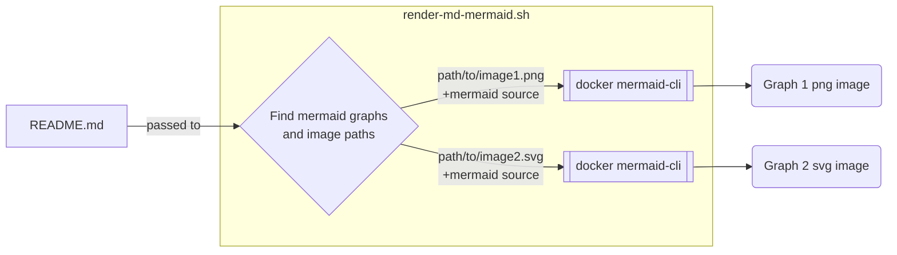

# Python-MvsL
Project to port the New Super Mario Bros. DS game mode Mario Vs Luigi to Python

Some mermaid suff that should get rendered

For real this time?
<!-- generated by mermaid compile action - START -->

  
Mermaid markup

<!-- generated by mermaid compile action - END -->
