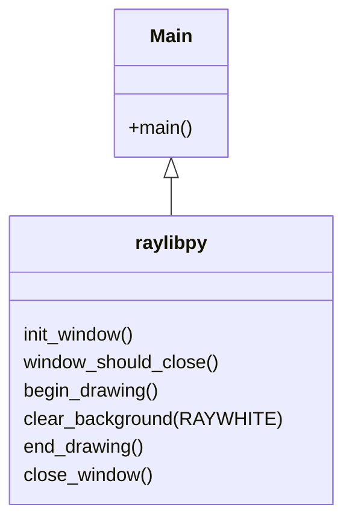

# Python-MvsL
Project to port the New Super Mario Bros. DS game mode Mario Vs Luigi to Python

Here's a class tree (don't mention they aren't classes lol, just tesing):

```mermaid
classDiagram
    Main <|-- raylibpy
    raylibpy: init_window()
    raylibpy: window_should_close()
    raylibpy: begin_drawing()
    raylibpy: clear_background(RAYWHITE)
    raylibpy: end_drawing()
    raylibpy: close_window()
    Main: +main()
```
